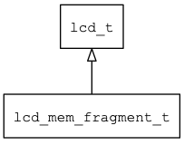

## lcd\_mem\_fragment\_t
### 概述


片段的LCD。

在一些低端平台没有足够的内存提供一个完整的framebuffer，此时我们用一小块内存模拟framebuffer，
每次只画屏幕上一小块。这样可以有些避免屏幕闪烁的问题。
----------------------------------
### 函数
<p id="lcd_mem_fragment_t_methods">

| 函数名称 | 说明 | 
| -------- | ------------ | 
| <a href="#lcd_mem_fragment_t_lcd_mem_fragment_create">lcd\_mem\_fragment\_create</a> | 创建lcd对象。 |
| <a href="#lcd_mem_fragment_t_lcd_mem_fragment_get_buff">lcd\_mem\_fragment\_get\_buff</a> | 获取framebuffer的地址。 |
#### lcd\_mem\_fragment\_create 函数
-----------------------

* 函数功能：

> <p id="lcd_mem_fragment_t_lcd_mem_fragment_create">创建lcd对象。

* 函数原型：

```
lcd_t* lcd_mem_fragment_create (wh_t w, wh_t h);
```

* 参数说明：

| 参数 | 类型 | 说明 |
| -------- | ----- | --------- |
| 返回值 | lcd\_t* | 返回lcd对象。 |
| w | wh\_t | 宽度。 |
| h | wh\_t | 高度。 |
#### lcd\_mem\_fragment\_get\_buff 函数
-----------------------

* 函数功能：

> <p id="lcd_mem_fragment_t_lcd_mem_fragment_get_buff">获取framebuffer的地址。

* 函数原型：

```
uint8_t* lcd_mem_fragment_get_buff (lcd_t* lcd);
```

* 参数说明：

| 参数 | 类型 | 说明 |
| -------- | ----- | --------- |
| 返回值 | uint8\_t* | 返回framebuffer的地址。 |
| lcd | lcd\_t* | lcd对象。 |
