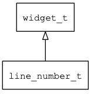

## line\_number\_t
### 概述


行号。多行编辑器的行号。

line\_number\_t是[widget\_t](widget_t.md)的子类控件，widget\_t的函数均适用于line\_number\_t控件。

在xml中使用"lin\e_number"标签创建行号控件，一般配合mledit使用。如：

```xml
<mledit x="c" y="10" h="40%" w="90%" focus="true" left_margin="36" right_margin="16"
wrap_word="true">
<line_number x="0" y="0" w="32" h="100%" value="0"/>
<scroll_bar_d x="right" y="0" w="14" h="100%" value="0"/>
</mledit>
```

> 更多用法请参考：[mledit.xml](
https://github.com/zlgopen/awtk/blob/master/demos/assets/default/raw/ui/mledit.xml)

可用通过style来设置控件的显示风格，如字体的大小和颜色等等。如：

```xml
<line_number>
<style name="default">
<normal text_color="black" bg_color="#d0d0d0" text_align_h="right"/>
</style>
</line_number>
```

> 更多用法请参考：
[theme default](
https://github.com/zlgopen/awtk/blob/master/demos/assets/default/raw/styles/default.xml#L556)
----------------------------------
### 函数
<p id="line_number_t_methods">

| 函数名称 | 说明 | 
| -------- | ------------ | 
| <a href="#line_number_t_line_number_cast">line\_number\_cast</a> | 转换为line_number对象(供脚本语言使用)。 |
| <a href="#line_number_t_line_number_create">line\_number\_create</a> | 创建line_number对象 |
| <a href="#line_number_t_line_number_set_bottom_margin">line\_number\_set\_bottom\_margin</a> | 设置顶部边距。 |
| <a href="#line_number_t_line_number_set_line_height">line\_number\_set\_line\_height</a> | 设置行高。 |
| <a href="#line_number_t_line_number_set_top_margin">line\_number\_set\_top\_margin</a> | 设置顶部边距。 |
| <a href="#line_number_t_line_number_set_yoffset">line\_number\_set\_yoffset</a> | 设置y偏移。 |
#### line\_number\_cast 函数
-----------------------

* 函数功能：

> <p id="line_number_t_line_number_cast">转换为line_number对象(供脚本语言使用)。

* 函数原型：

```
widget_t* line_number_cast (widget_t* widget);
```

* 参数说明：

| 参数 | 类型 | 说明 |
| -------- | ----- | --------- |
| 返回值 | widget\_t* | line\_number对象。 |
| widget | widget\_t* | line\_number对象。 |
#### line\_number\_create 函数
-----------------------

* 函数功能：

> <p id="line_number_t_line_number_create">创建line_number对象

* 函数原型：

```
widget_t* line_number_create (widget_t* parent, xy_t x, xy_t y, wh_t w, wh_t h);
```

* 参数说明：

| 参数 | 类型 | 说明 |
| -------- | ----- | --------- |
| 返回值 | widget\_t* | 对象。 |
| parent | widget\_t* | 父控件 |
| x | xy\_t | x坐标 |
| y | xy\_t | y坐标 |
| w | wh\_t | 宽度 |
| h | wh\_t | 高度 |
#### line\_number\_set\_bottom\_margin 函数
-----------------------

* 函数功能：

> <p id="line_number_t_line_number_set_bottom_margin">设置顶部边距。

* 函数原型：

```
ret_t line_number_set_bottom_margin (widget_t* widget, int32_t bottom_margin);
```

* 参数说明：

| 参数 | 类型 | 说明 |
| -------- | ----- | --------- |
| 返回值 | ret\_t | 返回RET\_OK表示成功，否则表示失败。 |
| widget | widget\_t* | 控件对象。 |
| bottom\_margin | int32\_t | 顶部边距。 |
#### line\_number\_set\_line\_height 函数
-----------------------

* 函数功能：

> <p id="line_number_t_line_number_set_line_height">设置行高。

* 函数原型：

```
ret_t line_number_set_line_height (widget_t* widget, int32_t line_height);
```

* 参数说明：

| 参数 | 类型 | 说明 |
| -------- | ----- | --------- |
| 返回值 | ret\_t | 返回RET\_OK表示成功，否则表示失败。 |
| widget | widget\_t* | 控件对象。 |
| line\_height | int32\_t | 行高。 |
#### line\_number\_set\_top\_margin 函数
-----------------------

* 函数功能：

> <p id="line_number_t_line_number_set_top_margin">设置顶部边距。

* 函数原型：

```
ret_t line_number_set_top_margin (widget_t* widget, int32_t top_margin);
```

* 参数说明：

| 参数 | 类型 | 说明 |
| -------- | ----- | --------- |
| 返回值 | ret\_t | 返回RET\_OK表示成功，否则表示失败。 |
| widget | widget\_t* | 控件对象。 |
| top\_margin | int32\_t | 顶部边距。 |
#### line\_number\_set\_yoffset 函数
-----------------------

* 函数功能：

> <p id="line_number_t_line_number_set_yoffset">设置y偏移。

* 函数原型：

```
ret_t line_number_set_yoffset (widget_t* widget, int32_t yoffset);
```

* 参数说明：

| 参数 | 类型 | 说明 |
| -------- | ----- | --------- |
| 返回值 | ret\_t | 返回RET\_OK表示成功，否则表示失败。 |
| widget | widget\_t* | 控件对象。 |
| yoffset | int32\_t | 行高。 |
