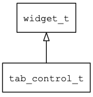
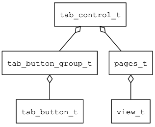

## tab\_control\_t
### 概述


标签控件。

它本身不提供布局功能，仅提供具有语义的标签，让xml更具有可读性。

标签控件通常会包含一个pages控件和一个tab\_button\_group控件。




tab\_control\_t是[widget\_t](widget_t.md)的子类控件，
widget\_t的函数均适用于tab\_control\_t控件。

在xml中使用"tab\_control"标签创建标签控件。如：

```xml
<tab_control x="0" y="0" w="100%" h="100%" >
<pages x="c" y="20" w="90%" h="-60" value="1">
...
</pages>
<tab_button_group>
...
</tab_button_group>
</tab_control>
```

> 更多用法请参考：
[tab control](https://github.com/zlgopen/awtk/blob/master/demos/assets/default/raw/ui/)
----------------------------------
### 函数
<p id="tab_control_t_methods">

| 函数名称 | 说明 | 
| -------- | ------------ | 
| <a href="#tab_control_t_tab_control_cast">tab\_control\_cast</a> | 转换tab_control对象(供脚本语言使用)。 |
| <a href="#tab_control_t_tab_control_create">tab\_control\_create</a> | 创建tab_control对象 |
#### tab\_control\_cast 函数
-----------------------

* 函数功能：

> <p id="tab_control_t_tab_control_cast">转换tab_control对象(供脚本语言使用)。

* 函数原型：

```
widget_t* tab_control_cast (widget_t* widget);
```

* 参数说明：

| 参数 | 类型 | 说明 |
| -------- | ----- | --------- |
| 返回值 | widget\_t* | tab\_control对象。 |
| widget | widget\_t* | tab\_control对象。 |
#### tab\_control\_create 函数
-----------------------

* 函数功能：

> <p id="tab_control_t_tab_control_create">创建tab_control对象

* 函数原型：

```
widget_t* tab_control_create (widget_t* parent, xy_t x, xy_t y, wh_t w, wh_t h);
```

* 参数说明：

| 参数 | 类型 | 说明 |
| -------- | ----- | --------- |
| 返回值 | widget\_t* | 对象。 |
| parent | widget\_t* | 父控件 |
| x | xy\_t | x坐标 |
| y | xy\_t | y坐标 |
| w | wh\_t | 宽度 |
| h | wh\_t | 高度 |
